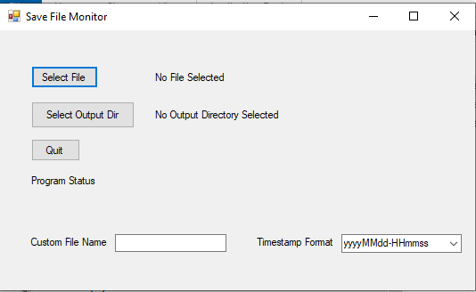

# SaveFileMonitor

SaveFileMonitor is a simple Windows Forms application written in C# that monitors changes to a selected file and creates a copy of the file whenever it is modified.  This is intended for use when playing long RPG video games and you may want to reload back to a point in time for missed content or achievements.

## Features

- Select a file to monitor for changes.
- Select an output directory where copies of the monitored file will be saved.
- Automatically create a copy of the monitored file whenever it is modified.
- View status messages about file monitoring and copy creation.

## How to Use

1. **Select File to Monitor**: Click on the "Select File" button and choose the file you want to monitor for changes.

2. **Select Output Directory**: Click on the "Select Output Directory" button and choose the directory where copies of the monitored file will be saved.

3. After selecting the file and output directory, the application will start monitoring the selected file for changes. Status messages will be displayed indicating the current status of the monitoring process.

4. **Quit**: Click on the "Quit" button to exit the application.

## Requirements

- Windows operating system
- .NET Framework 4.5 or higher

## Development

SaveFileMonitor is developed using C# and Windows Forms in Visual Studio. You can open the project in Visual Studio to view and modify the source code.

## License

This project is licensed under the MIT License. See the [LICENSE](LICENSE) file for details.
